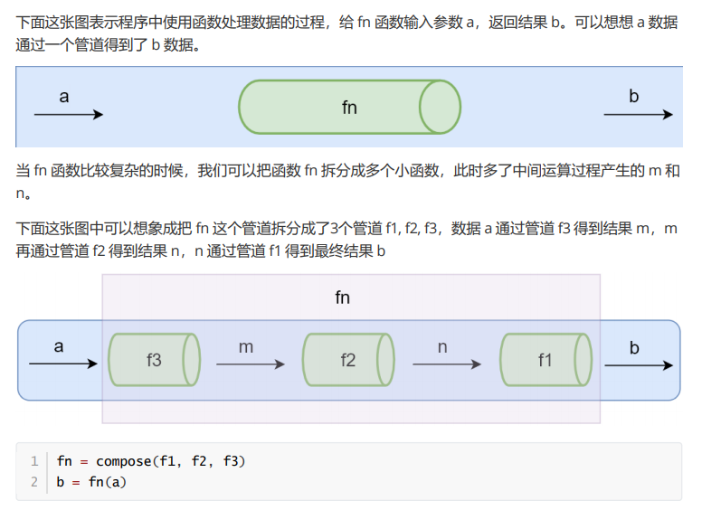

## 函数式编程

### 什么是函数式编程

* 函数式编程（Functional Programming,FP),FP是编程范式之一。
* 面向对象：把现实世界中的事物抽象成程序世界中的类和对象，用过封装、继承和多态来演示事物事件的联系。
* 函数式编程：把现实世界的事物与事物之间的联系抽象到程序世界（对运算过程进行抽象）
   * 程序的本质：根据输入通过某种运算获得相应的输出，程序开发过程中会涉及很多有输入和输出的函数
   * x -> f(联系、映射) -> y，y=f(x)
   * 函数式编程中的函数指的不是程序中的函数(方法)，而是数学中的函数即映射关系，例如：y= sin(x)，x和y的关系
   * 相同的输入始终要得到相同的输出(纯函数)
   * 函数式编程用来描述数据(函数)之间的映射
* 函数式编程不会保留计算中间的结果，所以变量是不可变的（无状态的）
* 我们可以把一个函数的执行结果交给另一个函数去处理
```
// 非函数式
let num1 = 2
let num2 = 3
let sum = num1 + num2
console.log(sum)
// 函数式
function add (n1, n2) {
  return n1 + n2
}
let sum = add(2, 3)
console.log(sum)
```
### 函数是一等公民

* 函数可以存储在变量中
* 函数可以作为参数
* 函数可以作为返回值
```
const BlogController = {
  index (posts) { return Views.index(posts) }
}
// 优化
const BlogController = {
  index: Views.index
}
```

### 高阶函数

* 可以把函数作为参数传递给另一个函数
* 可以把函数作为另一个函数的返回值
* 常用高阶函数
   * forEach
   * map
   * filter
   * every
   * some
   * find/findIndex
   * reduce
   * sort
* 使用高阶函数的意义
   * 抽象可以帮我们屏蔽细节，只需要关注于我们的目标
   * 高阶函数可以用来抽象通用的问题
```
// forEach
function forEach(arr, fn) {
  for(let i = 0, len = arr.length; i < len; i++){
    fn(arr[i])
  }
}

// filter
function filter(arr, fn) {
  let results = []
  for(let i = 0, len = arr.length; i < len; i++){
    if(fn(arr[i])){
      results.push(arr[i])
    }
  }
  return results
}

// map
function map(arr, fn) {
  let results = []
  for(let value of arr){
    results.push(fn(value))
  }
  return results
}

// every
function every(arr, fn) {
  let result = true
  for(let value of arr){
    result = fn(value)
    if(!result) break
  }
  return result
}

// some
function some(arr, fn) {
  let result = false
  for(let value of arr){
    result = fn(value)
    if(result) break
  }
  return result
}

// once
function once(fn) {
  let done = false
  return function () {
    if(!done){
      done = true
      return fn.apply(this,arguments)
    }
  }
}
```

### 闭包

* 闭包：函数和其周围的状态（词法环境）的引用捆绑在一起形成闭包
   
   * 可以在另一个作用域中调用一个函数的内部函数并访问到该函数的作用域中的成员
* 闭包的本质：函数在执行的时候会放到一个执行栈上，当函数执行完毕之后会从执行栈上移除，但是堆上的作用域成员因为被外部引用不能释放，因此内部函数依然可以访问到外部函数的成员
* 产生：
  * 函数嵌套
  * 内部函数引用外部函数局部变量
  * 执行外部函数
* 作用：
  * 延长局部变量的生命周期
  * 让函数外面操作（读/写）函数内部的数据
* 缺点：容易导致内存泄漏
  ```
  var a = [];
  for(var i = 0; i < 10; i++) {
    a[i] = ((i) => {
      return function() {
        console.log(i)
      }
    })(i)
  }
  a[6]()
  ```
* 节流与防抖
  * 节流（滚轮事件），在单位时间内让函数只调用一次，是第一次生效
  * 防抖（下拉选模糊查询），在单位时间内让函数只调用一次，是最后一次生效
  ```
  // 节流
  function throtte(fn, time) {
    let startTime = 0
    return function () {
      const endTime = Date.now()
      if(endTime - startTime >= time){
        fn.apply(this,arguments)
        startTime = endTime
      }
    }
  }
  
  // 防抖
  function debounce(fn, time) {
    let timer = null
    return function () {
      clearTimeout(timer)
      const args = arguments
      timer = setTimeout(() => {
        fn.apply(this.args)
      })
    }
  }
  ```

### 函数柯里化

* 当一个函数有多个参数的时候先传递一部分参数调用它（这部分参数以后永远不变）
* 然后返回一个新的函数接收剩余的参数，返回结果
* 作用：
  * 参数复用，减少重复传递不变的参数（利用事件闭包原理，让前面传输过来的参数不要被释放掉）
  * 延迟计算，节流 防抖
  * 提前确认（用来对浏览器兼容性作出一些判断，比如事件绑定）
* 实现
  ```
  // 函数柯里化
  function curry(fn) {
    return function curriedFn(...args) {
      if(args.length < fn.length){
        return function (...args2) {
          return curriedFn(...args,...args2)
        }
      }else{
        return fn(...args)
      }
    }
  }
  
  function add(a, b, c) {
    return a + b + c
  }
  
  let addCurry = curry(add)
  console.log(addCurry(1)(2,3))
  console.log(addCurry(1,2,3))
  console.log(addCurry(1)(2)(3))
  ```
  ```
  function curry2() {
    let data = [...arguments]
    function tmp(...args) {
      data = [...data,...args]
      return tmp
    }
    tmp.toString = function () {
      return data.reduce((pre,cur) => pre + cur,0)
    }
    return tmp
  }
  curry2(1)
  curry2(1,4)(2)
  curry2(1,4,3,4)
  ```
* 优点：
  * 柯里化可以让我们给一个函数传递较少的参数得到一个已经记住了某些固定参数的新函数
  * 这是一种对函数参数的缓存
  * 让函数变的更灵活，让函数的粒度更小
  * 可以把多元函数转换成一元函数，可以组合使用函数产生强大的功能

### 纯函数

* 相同的输入永远会得到相同的输出，而且没有任何可观察的副作用
* 数组的 slice 和 splice 分别是：纯函数和不纯的函数
  * slice 返回数组中的指定部分，不会改变原数组
  * splice 对数组进行操作返回该数组，会改变原数组
* 优点：
  * 可缓存：因为纯函数对相同的输入始终得到相同的结果，所以可以把纯函数的结果缓存起来
  ```
  // memorize记忆函数
  function memorize(f) {
    let cache = {}
    return function () {
      let arg_str = JSON.stringify(arguments)
      cache[arg_str] = cache[arg_str] || f.apply(f,arguments)
      return cache[arg_str]
    }
  }
  ```
  * 可测试
  * 并行处理
    * 在多线程环境下并行操作共享的内存数据可能会出现意外情况
    * 纯函数不需要访问共享的内存数据，所以在并行环境下可以任意运行纯函数（Web Worker)
* 副作用
  
  * 如果函数依赖于外部的状态就无法保证输出相同，就会带来副作用

### 函数组合（compose)

* 函数组合：如果一个函数要经过多个函数处理才能得到最终值，这个时候可以把中间过程的函数合并成一个函数
  * 函数组合默认从右到左执行
  * 函数的组合要满足结合律
  
* lodash中组合函数有 flow() 与 flowRight()
  * flow 从左到右运行
  * flowRight 从右向左运行
  ```
  // lodash
   const _ = require('lodash')
   const f = _.flowRight(_.toUpper, _.first, _.reverse)
   
   // 模拟实现lodash的flowRight方法
   function compose(...fns) {
     return function (value) {
       return fns.reverse().reduce((pre,cur) => cur(pre),value)
     }
   }
   
   // 调试
   const trace = curry((tag, v) => {
     console.log(tag, v)
     return v
   })
   
   const f = compose(first,trace('reverse'),reverse)
   console.log(f(['one', 'two', 'three']))

  ```
### lodash

const _ = require('lodash)

### Ponit Free

* 我们可以把数据处理的过程定义成与数据无关的合成运算，不需要用到代表数据的那个参数，只要把简单的运算步骤合成到一起，在使用这种模式之前我们需要定义一些辅助的基本运算函数。
  * 不需要指明需要处理的数据
  * 只需要合成运算过程
  * 需要定义一些辅助的基本运算函数
  ```
  const fp = require('lodash/fp')
  const firstLetterToUpper = fp.flowRight(join('. '),
  fp.map(fp.flowRight(fp.first, fp.toUpper)), split(' '))
  console.log(firstLetterToUpper('world wild web'))
  // => W. W. W
  ```

