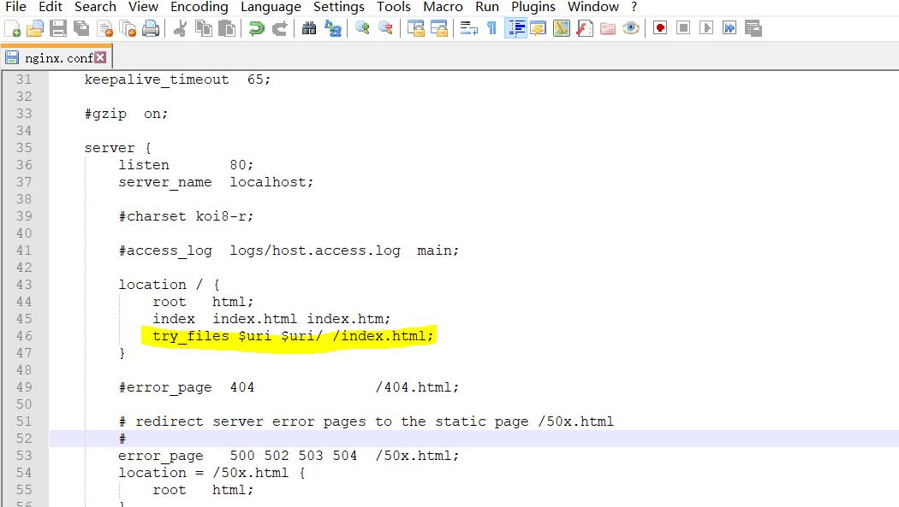

### 完整的导航解析流程

1. 导航被触发。
2. 在失活的组件里调用 `beforeRouteLeave` 守卫。
3. 调用全局的 `beforeEach` 守卫。
4. 在重用的组件里调用 `beforeRouteUpdate` 守卫 (2.2+)。
5. 在路由配置里调用 `beforeEnter`。
6. 解析异步路由组件。
7. 在被激活的组件里调用 `beforeRouteEnter`。
8. 调用全局的 `beforeResolve` 守卫 (2.5+)。
9. 导航被确认。
10. 调用全局的 `afterEach` 钩子。
11. 触发 DOM 更新。
12. 调用 `beforeRouteEnter` 守卫中传给 `next` 的回调函数，创建好的组件实例会作为回调函数的参数传入。

### 1. 动态路由

```

```


### 2. 命名视图

### 3. 编程式导航

```js
this.$router.push('/')
this.$router.push({name:'Home'})
this.$router.replace('/')
this.$router.go(-1)
```

### 4. Hash 模式 与 History 模式的区别

#### 4.1 表现形式的区别

​	1. hash 模式多了一个 #

#### 4.2 原理的区别

 1. Hash 模式是基于锚点，以及 onhashchange 事件

    * URL 中 # 后面的内容作为路径地址
    * 监听 hashchange 事件
    * 根据当前路由地址找到对应组件重新渲染

 2. History 模式是基于 HTML5 中的 History API

    * 通过 history.pushState() 方法改变地址栏
    * 监听 popState 事件
    * 根据当前路由地址找到对应组件重新渲染

    ```js
    history.pushState()   // ie10以后才支持，所以兼容ie 9 需要使用 hash
    history.replaceState()
    ```

#### 4.3 History 模式使用

需要服务器支持

单页应用中，服务端不存在 http://www.testurl.com/login 这样的地址，刷新发送请求会返回 404 找不到该页面

在服务端应该除了静态资源外都返回单页应用的 index.html

* nodejs 配置

  原生 nodejs

  ```js
  const http = require('http')
  const fs = require('fs')
  const httpPort = 80
  
  http.createServer((req, res) => {
    fs.readFile('index.html', 'utf-8', (err, content) => {
      if (err) {
        console.log('We cannot open "index.html" file.')
      }
  
      res.writeHead(200, {
        'Content-Type': 'text/html; charset=utf-8'
      })
  
      res.end(content)
    })
  }).listen(httpPort, () => {
    console.log('Server listening on: http://localhost:%s', httpPort)
  })
  ```

  

  express : 使用 [connect-history-api-fallback 中间件](https://github.com/bripkens/connect-history-api-fallback)

  ```js
  const path = require('path')
  const express = require('express')
  const history = require('connect-history-api-fallback')
  const app = express()
  app.use(history())
  app.use(express.static(path.join(__dirname,'../app/dist')))
  
  app.listen(3000,() => {
    console.log('服务器开启，端口：3000')
  })
  ```

  

* Nginx 配置

  * 从官网下载 Nginx 压缩包

  ```bash
  启动 start nginx
  重启 nginx -s reload
  停止 nginx -s stop
  ```

  ```js
  // nginx.conf
  
  location / {
    try_files $uri $uri/ /index.html;
  }
  ```

  


### vue-router 实现原理

### vue-router 实现

1. install
2. constructor
3. createRouteMap
4. initComponents
5. init
6. initEvent

```js

let _Vue = null
class VueRouter {
  static install(Vue){
    // 1. 判断当前插件是否已经被安装
    if(VueRouter.install.installed && _Vue === Vue){
      return
    }
    VueRouter.install.installed = true
    // 2. 把 Vue 构造函数记录到全局变量
    _Vue = Vue
    // 3. 把创建 Vue 实例时候传入的 router 对象注入到 vue 实例上
    
    // 混入
    _Vue.mixin({
      beforeCreate(){
        if(this.$options.router){
          _Vue.prototype.$router = this.$options.router
          this.$options.router.init()
        }
      }
    })
  }
  
  constructor(options){
    this.options = options
    this.routeMap = {}
    this.data = _Vue.observable({
      current:'/'
    })
  }
  
  init(){
    this.createRouteMap()
    this.initComponents(_Vue)
    this.initEvent()
  }
  
  createRouteMap(){
    // 遍历所有的路由规则，把路由规则解析成键值对的形式，存储到 routeMap 中
    this.options.routes.forEach(route => {
      this.routeMap[route.path] = route.component
    })
  }
  
  /*
  initComponents(Vue){
    Vue.component('router-link',{
      props:{
        to:String
      },
      template:'<a :href="to"><slot></slot></a>'
    })
  }
  */
  
  initComponents(Vue){
    Vue.component('router-link',{
      props:{
        to:String
      },
      render(h){
        return h('a',{
          attrs:{
            href:this.to
          },
          on:{
            click:this.clickHandler
          }
        },[
          this.$slots.default
        ])
      },
      methods:{
        clickHandler(e){
          history.pushState({},'',this.to)
          this.$router.data.current = this.to
          e.preventDefault()
        }
      }
    })
    
    const self = this
    Vue.component('router-view',{
      render(h){
        const component = self.routeMap[self.data.current]
        return h(component)
      }
    })
  }
  
  initEvent(){
    window.addEventListener('popstate',() => {
      this.data.current = window.location.pathname
    })
  }
}

export default VueRouter
```


