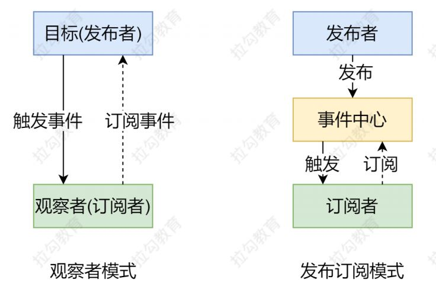

### 数据驱动

开发过程中仅需要关注数据本身，不需要关注数据是如何渲染到视图

### 数据响应式

数据模型仅仅是普通的 JavaScript 对象，而当我们修改数据时，视图会进行更新，避免了繁琐的 DOM 操作，提高开发效率

1. vue2 Object.defineProperty

   ```
   let data = {
       msg: 'hello'
   }
     
   fn(data, 'msg', data.msg)
   
   function fn(obj, key, val) {
       Object.defineProperty(obj, key, {
         enumerable: true, // 可枚举（可遍历）
         configurable: true, // 可配置（可以使用 delete 删除，可以通过 defineProperty 重新定义）
         get() {
           return val
         },
         set(v) {
           if (v === val) {
             return
           }
           val = v
           document.getElementById('app').innerText = val
         }
       })
   }
   ```

   

2. vue3 Proxy

   ```
   let data = {
       msg: 'hello'
   }
   let vm3 = new Proxy(data, {
       get(target, key) {
         console.log('get,target,key', key, target)
         return target[key]
       },
       set(target, key, v) {
         console.log('set', v)
         if (v === target[key]) {
           return
         }
         target[key] = v
         document.getElementById('app').innerText = target[key]
       }
   })
   ```

   

3. 发布订阅模式

   ```
   class EventEmitter {
     constructor() {
       // {'clicl':[fn1,fn2], 'change':[fn1]}
       this.subs = Object.create(null)
     }
   
   	// 订阅
     $on(eventType, handler) {
       this.subs[eventType] = this.subs[eventType] || []
       this.subs[eventType].push(handler)
     }
   
   	// 发布
     $emit(eventType, data) {
       if (this.subs[eventType]) {
         this.subs[eventType].forEach(handler => {
           handler(data)
         })
       }
     }
   }
   ```

   

4. 观察者模式

   观察者（订阅者）-- Watcher

   	* update() : 当事件发生时，具体要做的事情

   目标（发布者）-- Dep

   	* subs ：存储所有的观察者
   	* addSub() : 添加观察者
   	* notify() : 当事件发生时，调用所有观察者的 update() 方法

   ```
   // 发布者-目标
   class Dep {
     constructor() {
       this.subs = [] // 记录所有的订阅者
     }
     addSub(sub) {
       if (sub && sub.update) {
         this.subs.push(sub)
       }
     }
     notify() {
       this.subs.forEach(sub => {
         sub.update()
       })
     }
   }
   
   // 订阅者-观察者
   class Watcher {
     update() {
       console.log('update')
     }
   }
   ```

   

5. 发布订阅模式 与 观察者模式区别

   * 观察者模式是由具体目标调度，比如当事件触发，Dep就会去调用观察者的方法，所以观察者模式的订阅者与发布者之间是存在依赖的
   * 发布/订阅模式由统一调度中心调用，因此发布者与订阅者不需要知道对方的存在

   


1. vue 响应式原理模拟

   

   * Vue 
     * 记录传入的选项，设置 $data/$el 
     * 把 data 的成员注入到 Vue 实例 负责调用 
     * Observer 实现数据响应式处理（数据劫持） 
     * 负责调用 Compiler 编译指令/插值表达式等 
   * Observer 
     * 数据劫持 
       * 负责把 data 中的成员转换成 getter/setter 
       * 负责把多层属性转换成 getter/setter 
       * 如果给属性赋值为新对象，把新对象的成员设置为 getter/setter 
     * 添加 Dep 和 Watcher 的依赖关系 
     * 数据变化发送通知 
   * Compiler 
     * 负责编译模板，解析指令/插值表达式 
     * 负责页面的首次渲染过程 
     * 当数据变化后重新渲染 
   * Dep 
     * 收集依赖，添加订阅者(watcher) 
     * 通知所有订阅者 
   * Watcher 
     * 自身实例化的时候往dep对象中添加自己 
     * 当数据变化dep通知所有的 Watcher 实例更新视图

### 双向绑定

数据改变，视图改变；视图改变，数据也随之改变

我们可以使用 v-model 在表单元素上创建双向数据绑定

### 


