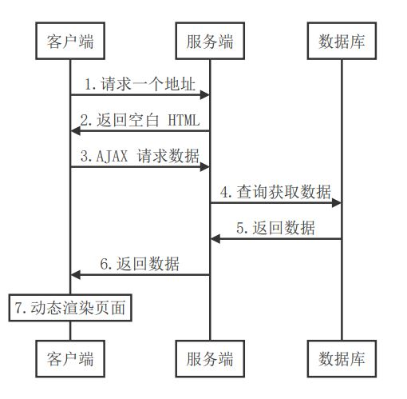
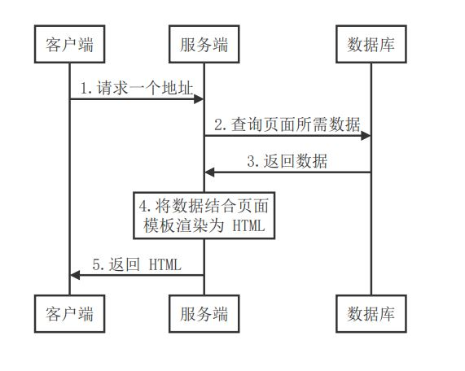
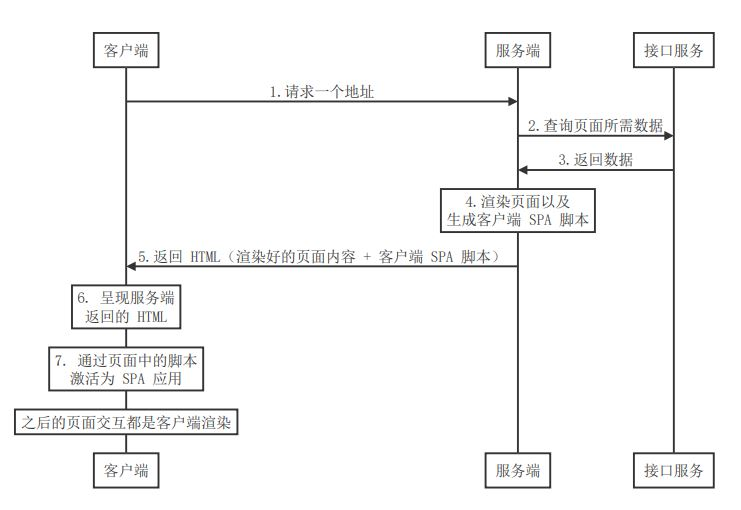

### 渲染

**什么是渲染：** 把（数据+模板）拼接到一起

请求后端接口数据，然后将数据同构模板绑定到语法绑定到页面中，最终呈现给用户。

### 1. SPA 单页面应用

**优点**

1. 用户体验好
2. 开发效率高
3. 渲染性能好
4. 可维护性好

**缺点**

1. 首屏渲染时间长

2. 不利于 SEO

   

### 2. 传统的服务端渲染

**缺点**

1. 应用的前后端部分完全耦合在一起，在前后端协同开发方面会有非常大的阻力
2. 前端没有足够的发挥空间，无法充分利用现在前端状态下的一些更优秀的方案
3. 由于内容都是在服务端动态生成的，所以服务端的压力较大
4. 相比目前流行的 SPA 应用来说，用户体验一般

### 3. 同构渲染（现代化的服务端渲染）

**同构应用**：基于 react 、vue 框架，客户端渲染和服务器端渲染的结合，在服务器端执行一次，用于实现服务器端渲染（首屏直出），在客户端再执行一次，用于接管页面交互，核心解决 SEO 和首屏渲染慢的问题

1. 客户端发起请求
2. 服务端渲染首屏内容 + 生成客户端 SPA 相关资源
3. 服务端将生成的首屏资源发送给客户端
4. 客户端直接展示服务端渲染好的首屏内容
5. 首屏中的 SPA 相关资源执行之后会激活客户端 Vue
6. 之后客户端所有的交互都由客户端 SPA 处理

**优点**：首屏渲染速度快、有利于 SEO

**缺点**：

1. 开发成本高
2. 设计构建设置和部署的更多要求。与可以部署在任何静态文件服务器上的完全静态单页面应用程序（SPA）不同，服务器渲染应用程序，需要处于 Node.js server 运行环境
3. 更多的服务器端负载。在 Node.js 中渲染完整的应用程序，显然会比仅仅提供静态文件的 server 更加大量占用 CPU 资源（CPU-intensive - CPU 秘籍），因此如果你预料在高流量环境（high traffic）下使用，请准备相应的服务器负载，并明智地采用缓存策略
