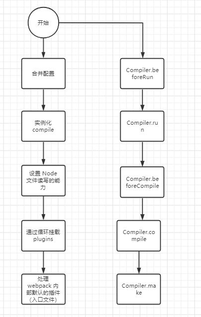

### 定位 webpack 打包入口

1.  cmd 文件核心的作用就是组装了 node ***/webpack/bin/webpack.js

2.  webpack.js 中核心的操作就是 require 了 node_modules/webpack-cli/bin/cli.js
3.  cli.js
   * 当前文件一般有二个操作，处理参数，将参数交给不同的逻辑（分发业务）
   * options
   * compiler
   * compiler.run(  )

### webpack 打包流程

### webpack 钩子

 1. beforeRun

 2. run

 3. thisCompilation

 4. compilation

 5. beforeCompile

 6. compile

 7. make

 8. afterCompile

### 实现一个 webpack 

