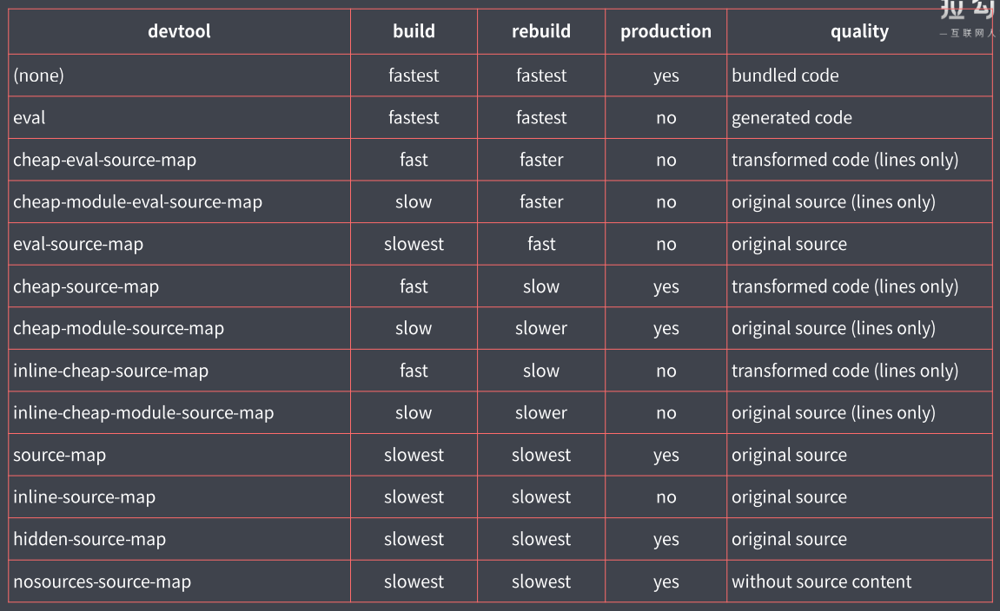

## webpack

### webpack 自动编译+自动刷新浏览器

	#### 1. watch + BrowserSync

 1. 监听文件变化，自动重新打包

    ```
    yarn webpack --watch
    ```

2. BrowserSync 自动刷新浏览器

   ```
   browser-sync dist --files "**/*"   // 启动服务，监听dist目录下的文件变化
   ```

#### 2. webpack-dev-server

 1. 提供用于开发的HTTP Server

 2. j将自动编译和自动刷新浏览器等功能集成在一起

 3. 将打包记录暂时存放在内存中，不会生成 dist 文件

    ```
    yarn webpack-dev-server
    yarn webpack-dev-server --open   // 自动打开浏览器
    ```

	4. 只要是被 webpack 打包输出的文件，都可以正常访问监听到，额外的静态资源主要告诉webpack-dev-server，配置如下（使用了copy-webpack-plugin就不需要，但是copy-webpack-plugin一般只在上线前使用）

    ```
    devServer: {
    	contentBase: './public' ,      // 可以是字符串也可以是数组
    }
    ```

	5. 代理 API（跨域）

    ```
    devServer: {
    	contentBase: './public' ,      // 可以是字符串也可以是数组
    	proxy: {
    		'/api':{
    			target:'https://api.github.com',  // 代理目标服务器
    			pathRewrite:{
    				'^/api':'',   // 将 /api 替换
    			},
    			changeOrigin: true  
    			// 默认将浏览器主机名作为请求 GitHub 的主机名，服务器会根据主机名判断这个请求属于哪个网站，changeOrigin: true 会已实际代理请求这次发生的主机名请求
    		}
    	}
    }
    ```

### Source MaP 源代码地图

 * 映射转换过后的代码与源代码之间的关系

 * 解决前端编写的源代码与运行代码不一致所产生的问题

   ```
   // jquery-3.4.2.min.map
   version:'' --  // source map的版本
   sources:[] -- // 源文件的名称
   names:[]   -- // 原始变量的名称
   mappings:''-- base64/vlq 字符串，转换过后的代码与源代码映射关系
   
   添加注释引入source map 文件
   //# sourceMapplingURL=jquery-3.4.2.min.map
   ```

1. 配置 source map

   ```
   devtool:'source-map'
   
   /**
   eval:将模块代码放入eval执行，没有生成map,只能定位源代码具体文件的名称，没有具体的行列信息
   eval-source:可以定位到文件，行列信息,生成了map
   cheap-eval-source-map:只能定位到行,定位到的是经过loader转换后的代码
   cheap-module-eval-source-map:只能定位到行，定位到的是源代码即loader转换前的代码
   inline-source-map:使用dataurl的方式将dataurl嵌入到代码当中（代码体积变大，不用）
   hidden-source-map:生成了map文件，但是没引入，通常用于第三方包开发的时候用
   nosources-source-map:没有源代码，但是有行列信息，生产模式下使用，保护源代码
   */
   
   /**
   eval:是否使用eval执行模块代码
   cheap:是否包含行信息
   module:是否能够得到Loader处理之前的源代码
   */
   ```

   

   

2. 选择 source-map

   ```
   开发：cheap-module-eval-source-map
   生产：none -- 防止暴露源代码
   ```

### HMR 模块热替换（热更新）

 1. 只将修改的模块实时替换至应用中

 2. 开启HMR

    * 已经集成在 webpack-dev-server 中了

    * 需要手动处理模块热替换逻辑

    * 样式文件模块热替换可以了，js文件热替换不行，因为样式文件经过 style-loader 处理，style-loader 里已经处理了 HMR

      ```
      // 方式1.运行命令
      yarn webpack-dev-server --hot
      
      // 方式2.配置文件
      const webpack = reuqire('webpack')
      devserver:{
      	hot:true
      },
      plugins:[
      	new webpack.HotModuleReplacementPlugin()
      ]
      // 运行 yarn webpack-dev-server
      ```

    * API 处理 

      JS 模块热替换 ：需要对应处理

      处理图片热替换：直接将图片 src 替换为新的

      ```
      module.hot.accept('./editor',() => {
      	console.log('editor 模块更新了，需要这里手动处理热替换逻辑')
      })
      // hot --- HMR 的核心对象
      // accept --- 注册某个模块更新后的处理函数（路径，依赖路径更新后的处理函数）
      // 这样 editor 模块更新了，不会导致自动刷新
      ```

	3. 注意事项

    * 处理 HMR 的代码报错会导致自动刷新：将 hot 修改为 hotOnly 模式

      ```
      devserver:{
      	hotOnly:true
      }
      ```

    * 没启用 HMR 的情况下，HMR API 报错：先判断 module.hot 再处理

      ```
      if(module.hot){
      	module.hot.accept('./editor',() => {
              console.log('editor 模块更新了，需要这里手动处理热替换逻辑')
          })
      }
      ```

    * 代码中多了一些与业务无关的代码：关闭 HMR ，打包后文件里 处理热替换的代码都移除了，剩下了   if（false）{}  这样没有意义的代码，代码压缩时也会去掉

