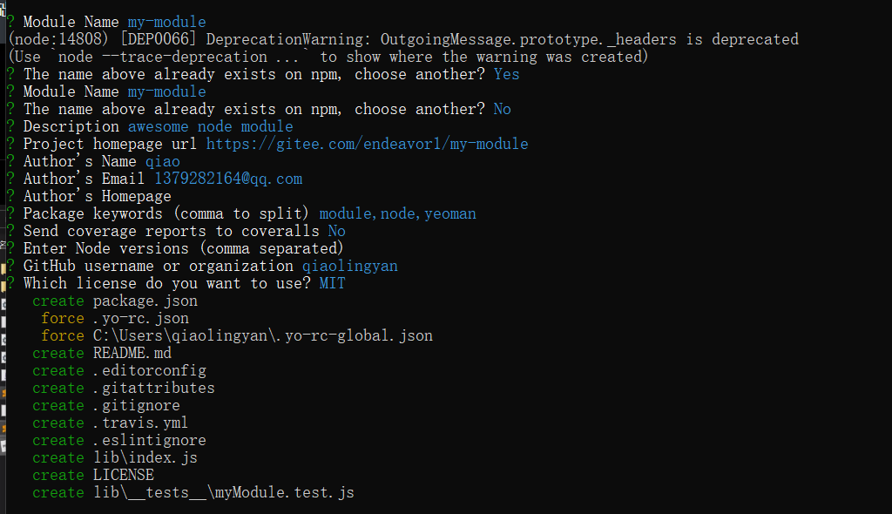
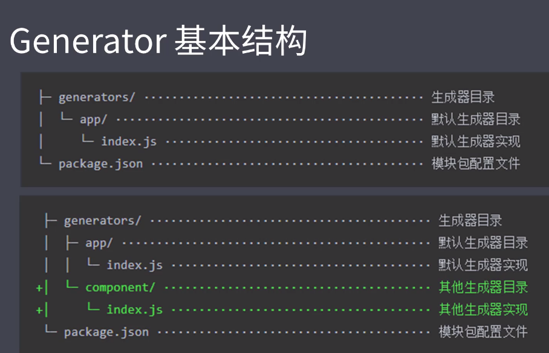

### 脚手架的本质作用
* 创建项目基础架构、提供项目规范和约定
  * 相同的组织结构
  * 相同的开发范式
  * 相同的模块依赖
  * 相同的工具配置
  * 相同的基础代码
  
### 前端脚手架
#### 脚手架作用
#### 常用的脚手架工具
* create-react-app
* vue-cli
* angular-cli
* Yeoman --根据一套模板生成对应的脚手架结构
* plop --- 在项目开发过程中创建特定类型的文件
#### 通用脚手架剖析
##### Yeoman --  https://yeoman.io
  * 安装：
    * 在全局范围安装yo----   yarn global add yo  
    * 安装对应的generator----  yarn global add generator-node
  * 创建目录 mkdir my-module
  * my-module下运行 ：
    * yo node
      报错：'yo' 不是内部或外部命令，也不是可运行的程序 或批处理文件。
      解决：npm安装yo npm install -g yo
    
##### 常见问题
1. yo generatorName 运行生成器时报错--'This generator (vueG:app) requires yeoman-environment at least 3.0.0-beta.1, current version is 2.10.3'
  * 报错原因:yeoman-generator 版本更新造成 最新更新至5.0.0
  * 解决方案:
    * 方案1：降低yeoman-environment版本之4.0--  npm install --save-dev yeoman-generator@4.0
    * 方案2：全局安装yeoman-environment，运行生成器命令：yoe run generatorName
      npm install -g yeoman-environment
      yoe run generatorName
2. 安装yeoman-generator 5.0  yoe run generatorName 文件读写报错-- Error: Error parsing namespace vueG    at Environment.requireNamespace (C:\Program Files\nodejs\node_modules\yeoman-environment\lib\namespace.js:68:13)
  * 报错原因：yeoman-generator 版本更新造成 最新更新至5.0.0并全局安装yeoman-environment
  * 解决方案：
    * 方案1:降低当前 yeoman-generator  至 4.0.0
    * 方案2: 检查generator-name, name中不要包含大写字母,不要使用特殊符号
3. yarn link  command cant find 问题解决
  * 报错原因：yarn的安装 为 npm 安装 yarn 的环境变量或者安装路径或者权限问题
  * 解决方案：
    * 方案1:  不用yarn 来运行生成器  而用 npm 来运行  (windows & mac 均适用)
      npm link
    * 方案2: window 为 yarn 配置环境变量 具体如果在windows上配置环境变量 可自行百度
##### sub generator（子级generator）
* 运行sub generator：yo node:cli
##### 常规使用步骤
1. 明确你的需求
2. 找到合适的generator
3. 全局范围安装找到的generator
4. 通过yo运行对应的generator
5. 通过命令行交互填写选项
6. 生成你所需要的项目结构
##### 自定义generator --基于yeoman搭建自己的脚手架
* 本质上是一个npm模块

* 名称 ： generator-name
  * mkdir generator-sample
  * cd generator-sample
  * yarn init
  * yarn add yeoman-generator
  * 添加目录结构 generators/app/index.js
    * 根据模板创建文件
    * app/templates/....  里面存放各个模板文件
  * 注册模块：npm link
  * 使用：yo sample
    * 报错解决：全局安装npm install -g yeoman-environment，运行生成器yoe run generatorName
 * 根据模板创建文件
 ```javascript
/*
* 此文件作为Generator的核心入口
* 需要导出一个继承自Yeoman Generator 的类型
* Yeoman Generator 在工作时会自动调用我们在此类型中定义的一些生命周期方法
* 我们在这些方法中可以通过父类提供的一些工具方法来实现一些功能，例如文件导入
* */
const Generator = require('yeoman-generator')
module.exports = class extends Generator {
  // 根据模板创建文件
  writing(){
    // Yeoman 自动在生成文件阶段调用此方法
    // 我们这里尝试往项目目录中写入文件
    // this.fs（父类当中的）两个参数：写入文件路径、写入文件内容
    /*this.fs.write(
      this.destinationPath('temp.txt'),
      Math.random().toString()
    )*/
    
    // 通过模板方式写入文件到目标目录
    // 模板文件路径
    const tmpl = this.templatePath('foo.txt')
    // 输出文件路径
    const output = this.destinationPath('foo.txt')
    // 模板数据上下文
    const context = { title:'Hello qiao', success:false}
    
    this.fs.copyTpl(tmpl,output,context)
  }
}
 ```
 * 接收用户收入
 ```javascript
const Generator = require('yeoman-generator')
module.exports = class extends Generator {
  // 接收用户收入
  promiting(){
    // Yeoman 在询问用户环节自动调用此方法
    // 在此方法中可以调用父类的 prompt()方法发出对用户的命令行询问
    return this.prompt([
      {
        type:'input',
        name:'name',
        message:'Your project name',
        default:this.appname  // 当前生成项目目录的文件夹名字
      }
    ]).then(answers => {
      // 用户输入的结果 { name:'user input value'}
      this.answers = answers
    })
  }
  // 根据模板创建文件
  writing(){
    
    // 通过模板方式写入文件到目标目录
    // 模板文件路径
    const tmpl = this.templatePath('bar.html')
    // 输出文件路径
    const output = this.destinationPath('bar.html')
    // 模板数据上下文
    const context = this.answers
    
    this.fs.copyTpl(tmpl,output,context)
  }
}
 ```
* vue 脚手架案例
  * 使用数组遍历的方式生成模板文件
```javascript
const Generator = require('yeoman-generator')

module.exports = class extends Generator {
  prompting(){
    return this.prompt([
      {
        type:'input',
        name:'name',
        message:'Your project name',
        default:this.appname
      }
    ]).then(answers => {
      this.answers = answers
    })
  }
  
  writing(){
    // 数组循环批量生成文件
    const templates = [
      '.browserslistrc',
      '.editorconfig',
      '.env.development',
      '.env.production',
      '.eslintrc.js',
      '.gitignore',
      'babel.config.js',
      'package.json',
      'postcss.config.js',
      'README.md',
      'public/favicon.ico',
      'public/index.html',
      'src/App.vue',
      'src/main.js',
      'src/router.js',
      'src/assets/logo.png',
      'src/components/HelloWorld.vue',
      'src/store/actions.js',
      'src/store/getters.js',
      'src/store/index.js',
      'src/store/mutations.js',
      'src/store/state.js',
      'src/utils/request.js',
      'src/views/About.vue',
      'src/views/Home.vue'
    ]
    templates.forEach(item => {
      this.fs.copyTpl(
        this.templatePath(item),
        this.destinationPath(item),
        this.answers
      )
    })
  }
}

```
  * npm link
  
* 发布generator模块
  * 项目源代码托管git
    * echo node_modules > .gitignore  // 忽略node_modules
  * 发布
    * npm publish 发布到npm上
    * yarn publish --registry=https://registry.yarnpkg.com（镜像）

##### Plop---一个小而美的脚手架工具
* react项目中使用Plop
  * 将plop模块作为项目开发依赖安装  yarn add plop --dev
  * 在项目根目录下创建一个plopfile.js文件
  * 在plopfile.js文件中定义脚手架任务
  ```javascript
  // Plop 入口文件，需要导出一个函数
  // 此函数接收一个plop对象，用于创建生成器任务
  
  module.exports = plop => {
    plop.setGenerator('component',{
      description:'create a component',
      prompts:[
        {
          type:'input',
          name:'name',
          message:'component name',
          default:'MyComponent'
        }
      ],
      actions:[
        {
          type:'add',
          path:'src/components/{{name}}/{{name}}.js',
          templateFile:'plop-templates/component.hbs'
        }
      ],
      actions:[
        {
          type:'add',
          path:'src/components/{{name}}/{{name}}.js',
          templateFile:'plop-templates/component.hbs'
        },
        {
          type:'add',
          path:'src/components/{{name}}/{{name}}.css',
          templateFile:'plop-templates/component.css.hbs'
        },
        {
          type:'add',
          path:'src/components/{{name}}/{{name}}.test.js',
          templateFile:'plop-templates/component.test.hbs'
        }
      ]
    })
  }

  ```
  * 编写用于生成特定类型文件的模板  plop-template/component.hbs
  * 通过plop提供的CLI运行脚手架任务  yarn plop component
  
#### 脚手架工作原理
##### 通过nodejs一个小的脚手架
* 创建一个目录 mkdir sample-scaffolding
* cd sample-scaffolding
* yarn init
* 在package.json中添加一个bin字段，，用于去指定CLI应用的入口文件 --- "bin": "cli.js"
* 创建 cli.js 文件
  ```javascript
  #!/usr/bin/env node
  
  // Node CLI应用入口文件必须要有这样的文件头
  // 如果是 Linux 或者 macOS 系统下还需要修改此文件的读写权限为 755
  // 具体就是通过 chmod 755 cli.js 实现修改
  
  console.log('cli working')
  ```
* npm link 注册到全局
* 运行 sample-scaffolding
* 询问用户问题
  
  * yarn add inquirer

 ```javascript
  #!/usr/bin/env node
  
  // Node CLI应用入口文件必须要有这样的文件头
  // 如果是 Linux 或者 macOS 系统下还需要修改此文件的读写权限为 755
  // 具体就是通过 chmod 755 cli.js 实现修改
  
  /* 脚手架的工作过程：
  * 1. 通过命令行交互询问用户问题
  * 2. 根据用户回答的结果生成文件
  * */
  const fs = require('fs')
  const path = require('path')
  const inquirer = require('inquirer')
  const ejs = require('ejs')
  
  inquirer.prompt([
    {
      type:'input',
      name:'name',
      message:'Project name?'
    }
  ]).then(answers => {
    // console.log(answers)
    // 根据用户回答的结果生成文件
    
    // 模板目录
    const tmplDir = path.join(__dirname,'templates')
    // 目标目录
    const destDir = process.cwd()  // 命令行执行的目录（在哪个目录执行）
    // 将模板下的文件全部转换到目标目录
    fs.readdir(tmplDir,(err,files) => {
      if(err) throw err
      files.forEach(file => {
        // file => 相对tmplDir的相对路径
        // 通过模板引擎渲染文件
        ejs.renderFile(path.join(tmplDir,file),answers,(err,result) => {
          if(err) throw err
          // 将结果写入目标文件
          fs.writeFileSync(path.join(destDir,file),result)
        })
      })
    })
  })

 ```

* 使用
  * mkdir demo
  * cd demo
  * sample-scaffolding
