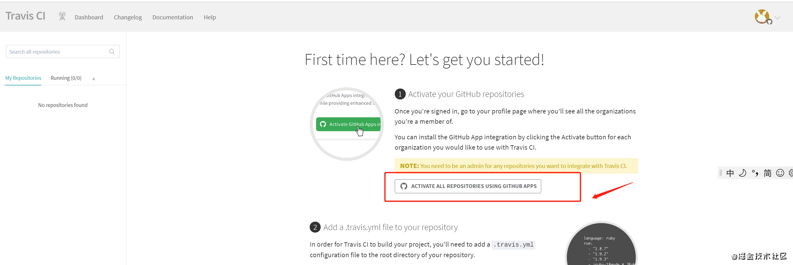
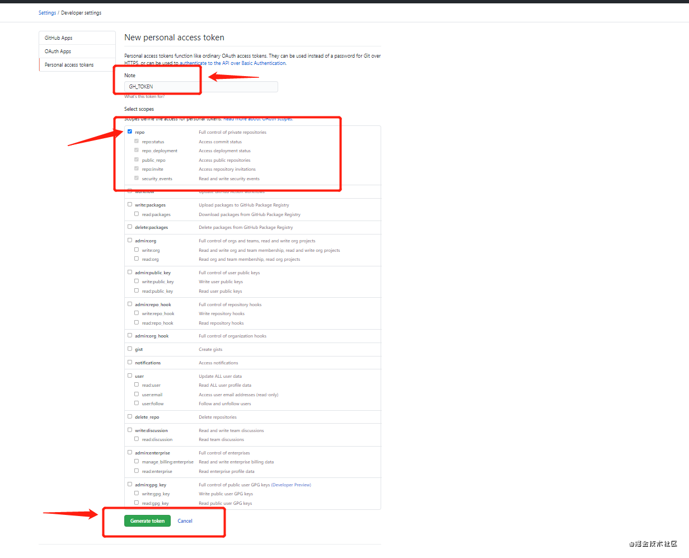
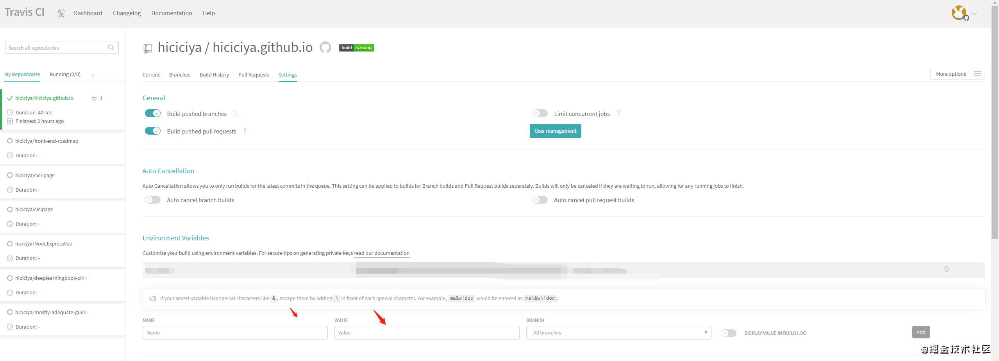
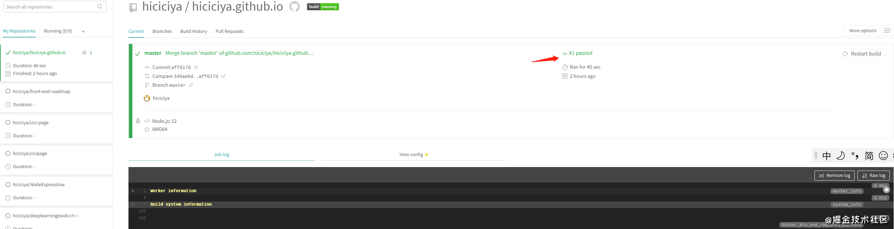
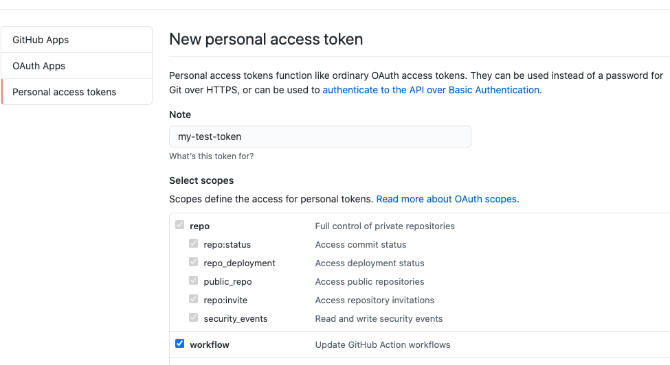
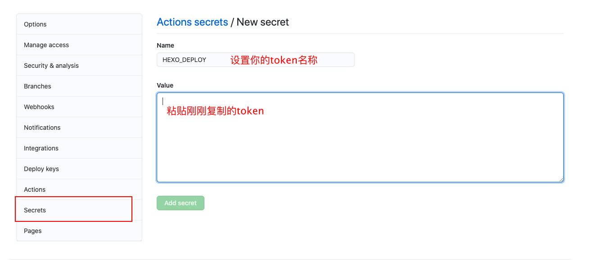

### 前言

采用 hexo + keep + github 搭建自己的博客

hexo 需要本地编译后，再把编译文件推送到 Github

### 开始搭建

1. 安装 node， 地址 [Nodejs](https://nodejs.org/en/download/)

2. 安装 hexo

   ```bash
   npm install hexo-cli -g

3. 初始化博客目录

   ```bash
   hexo init candy-qlr.github.io (candy-qlr替换成自己的)
   ```

4. 进入目录

   ```bash
   cd candy-qlr.github.io
   ```

5. 安装

   ```bash
   npm install
   ```

6. clean一下，然后生成静态页面

   ```bash
   hexo clean
   hexo g
    (g就是generate,生成的意思)
   ```

7. 运行博客网站

   ```bash
   hexo s 
    (s就是server,在服务器运行的意思)
   ```

8. 打开浏览器，输入 ```localhost:4000```。自此，个人网站搭建成功

### 发布到GitHub

1. github 创建一个账号 ```candy-qlr```

2. github 上创建一个``` candy-qlr.github.io``` 的 public仓库

   ```xxx.github.io```, xxx写你的名字，到时就可以通过 xxx.github.io 来访问你的博客了

   xxx 必须与你的 github  账号一致

3. 安装 ```hexo-deployer-git```

   ```bash
   npm install hexo-deployer-git --save
   ```

4. 配置```_config.yml```

   ```yaml
   deploy:
     type: git
     repo: https://github.com/candy-qlr/candy-qlr.github.io.git // 输入你的git地址
   ```

5. 推送网站到 Github 上

   ```bash
   hexo d
   	(d就是 deploy，部署上去的意思)
   ```

6. 访问博客

   浏览器输入 ```xxx.github.io```，就可以访问了

### 域名绑定

1. 添加 CNAME 文件

   ```bash
   # 进入sources
   cd sources
   # 创建CNAME文件，写入自己的域名，如：www.iwkxk.com
   touch CNAME
   复制代码
   ```

2. 在你的域名商后台进行 DNS 解析添加两条记录：

   ```
   1. 主机记录： @
       记录类型：A
       记录值：192.30.252.154 或者 192.30.252.153
   
   2. 主机记录： www
       记录类型： CNAME
       记录值： xxx.github.io  (这里就是你的github仓库名称)
   复制代码
   ```

3. GitHub 设置域名

   在你的 GitHub 设置域名，在你的 GitHub 博客项目中点击 Settings，在 GitHub Pages 下的 Custom domain 写上你的域名，然后 save。

### 网站优化

1. ```_config.yml``` 文件配置网站信息

   ```
   title: q's Blog
   subtitle: q的个人博客
   description: q的个人笔记
   keywords: JavaScript,Vue,Webpack,node,react
   author: qlr
   language: zh
   timezone: 
   ```

2. 主题修改

   * 选择一个主题 [https://hexo.io/themes/](https://hexo.io/themes/)

   * 将主题源码 fork 到自己仓库，下载安装主题

     ```bash
     npm install hexo-theme-keep
     ```

   * 根目录 ```_config.yml``` 文件中，修改 theme 为你的主题名字：

     ```bash
     theme: keep
     ```

   * 根据 keep 官网配置[keep]([https://keep-docs.xpoet.cn/usage-tutorial/quick-start.html#%E5%AE%89%E8%A3%85](https://keep-docs.xpoet.cn/usage-tutorial/quick-start.html#安装))

     添加标签

     添加分类

     添加评论
   
   * 配置 scripts 指令
   
     ```bash
     "scripts": {
       "dev": "hexo clean && hexo g && hexo s"
     },
     ```
   
   * 运行
   
     ```bash
     npm run dev
     ```

### 博客文章

1. 创建

   ```bash
   hexo new hello （这里的article写上你的文章的名称）
   ```

2. 打上标签与分类，文章开头

   ```
   ---
   title: Nuxt.js
   date: 2021-05-31 10:38:06
   tags: [vue, 服务端渲染]
   categories: [vue]
   ---
   ```

### 自动化部署 Travis CI

hexo 官方推荐 [Travis ](https://www.travis-ci.com/)

1. 登录 travis,使用 github 账号登录

2. Github 配置 Travis CI 权限

   点击 按钮`Activate all repositories using GitHub Apps`

   

   进入授权页面 点击 `APProve Install`

3. 创建 Personal Access Token

   登录 github.com ，点击 settings  -  Developer settings - Personal access tokens , 点击 **Generate new token**，输入 token 名称（**GH_TOKEN**），勾选 **repo** 选项，左下角`Generate token` Token生成成功 复制新生成的Token（一定要复制，只会看到这一次）

   

4.  Travis CI 配置 Environment Variables 对应的项目仓库配置环境变量

   * 回到 Travis CI主页 右侧选择选项目仓库 点击右上角 `More options`  下拉选择`Settings`

   * 滚动 至 `Environment Variables`

   * 新建环境变量  `Name`为`GH_Token` `VALUE`为我们在 GitHub 生成的 Token

     ps：保证 `DISPLAY VALUE IN BUILD LOG` 不被勾选 避免你的 Token 泄漏。

   

5. 项目配置 CI

   * 创建 .travis.yml 文件

   ```yaml
   // .travis.yml
   sudo: false
   language: node_js
   node_js:
     - 12 # use nodejs v12 LTS
   cache: npm
   branches:
     only:
       - master # build master branch only
   script:
     - hexo generate # generate static files
   deploy:
     provider: pages
     skip-cleanup: true
     github-token: $token // 创建的token名称
     keep-history: true
     on:
       branch: master
     local-dir: public
   ```

   * 提交本地代码至远端

   ```
   git add .
   git commit -m 'add travis config'
   git push origin master
   ```

   Travis CI 应该会自动开始运行，并将生成的文件推送到同一 repository 下的 gh-pages 分支下

   回到Travis CI 官网 如下图所示 完成部署

   

   

6. 修改 GitHubPages 部署分支

   * 回到Github对应项目主页 点击 `Settings`
   * 右侧侧边栏 选择 Pages Source 下 选择分支为 gh-pages (默认部署 为master分支) 点击`Save`

7. 浏览器 访问 xxxx.github.io

### 自动化部署 GitHub Actions

1. 准备服务器

2. 创建 GitHub仓库

   * 创建一个**私有仓库**用来存储 Hexo 项目源代码
   * **公共仓库**用来存储编译之后的静态页面
   * 当私有仓库的 `master` 有内容 `push` 进来时（例如：主题文件，文章 md 文件、图片等）， 会触发 GitHub Actions 自动编译并部署到公共仓库的 `master`分支。

3. ##### 创建 GitHub Token

   * 创建一个有 **repo** 和 **workflow** 权限的 [GitHub Token](https://github.com/settings/tokens/new) 。

     

4. ##### 创建 repository secret

   * 将上面生成的 Token 添加到私有仓库的 `Secrets` 里，并将这个新增的 `secret` 命名为 `HEXO_DEPLOY` （名字无所谓，看你喜欢）。

   * 步骤：私有仓库 -> `settings` -> `Secrets` -> `New repository secret`。

     

   * 新创建的 secret `HEXO_DEPLOY` 在 Actions 配置文件要用到，需跟配置文件保持一致！

5. ##### 添加 Actions 配置文件

   * 在你的 Hexo 项目根目录下创建 `.github` 文件夹。

   * 在 `.github` 文件夹下创建 `workflows` 文件夹。

   * 在 `workflows` 文件夹下创建 `hexo-deploy.yml` 文件。

     ```yaml
     name: deploying Hexo project to GitHub pages
     on:
       push:
         branches:
           - master # master 分支有 push 行为时就触发这个 action
     
     jobs:
       build-and-deploy:
         runs-on: ubuntu-latest
         steps:
           - name: Checkout
             uses: actions/checkout@master
     
           - name: Build and Deploy
             uses: theme-keep/hexo-deploy-github-pages-action@master # 使用专门部署 Hexo 到 GitHub pages 的 action
             env:
               PERSONAL_TOKEN: ${{ secrets.HEXO_DEPLOY }} # secret 名
               PUBLISH_REPOSITORY: wkxk/wkxk.github.io # 公共仓库，格式：GitHub 用户名/仓库名
               BRANCH: master # 分支，我这里是推送到wkxk/wkxk.github.io仓库里的master分支(根据自己的仓库进行填写)
               PUBLISH_DIR: ./public # 部署 public 目录下的文件
     ```

6. ##### 自动部署触发流程

   * 修改你的 Hexo 博客源代码。

   * 把你修改过的 Hexo 项目内容 `push` 到 GitHub 私有仓库的 `master` 分支。

   * GitHub Actions 检测到 `master` 分支有内容 `push` 进来，会自动执行 action 配置文件的命令，将 Hexo 项目编译成静态页面，然后部署到公共仓库的 `master` 分支。

   * 在私有仓库的 Actions 可以查看到你配置的 action。

